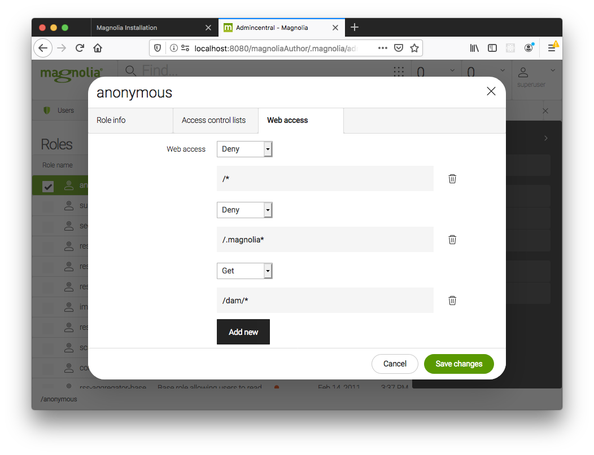

# Minimal Headless SPA Demos

The new Visual SPA Editor allows authors to edit your SPA, reducing your ongoing maintenance duties. (win!) But you get to keep everything fully headless.

This demo shows you how to use the basic features for both React and Angular.


## Pages and Components

The demo contains:

- Basic page template
- Contact page template

- Header component
- Paragraph component
- Image component
- List component
- Item component (available inside List component)
- Expander component

- Navigation component

# Setup

## Requirements

- Java (JDK)

- [Magnolia CLI](https://www.npmjs.com/package/@magnolia/cli) installed ([installation documentation](https://documentation.magnolia-cms.com/display/DOCS/Magnolia+CLI+v3))

## Install Magnolia with Magnolia CLI

In a terminal, navigate to the `magnolia` directory and run:

```
mgnl jumpstart
```

Choose `magnolia-community-demo-webapp` or `magnolia-dx-core-demo-webapp` as the version to download.

> Note: If you want to try the personalization feature - you will need `dx-core`. To get `dx-core` you will need an enterprise account, please contact Magnolia Sales team if you do not have one.
> Additionally you will need the version 2.1.0 higher of the [personalization modules](https://docs.magnolia-cms.com/product-docs/6.2/Modules/List-of-modules/Personalization-module.html).

(Magnolia is downloaded.)

## Add the demo light modules to Magnolia

Nothing to do here!
(The Magnolia instance is pre-configured to access the existing 'light-modules' directory.)

## Start Magnolia

From within the `magnolia` start Magnolia with:

```
mgnl start
```

Once the terminal shows `Server startup in X ms`

In your browser, open Magnolia at: http://localhost:8080/magnoliaAuthor/

## Accessing Magnolia

You can log in to Magnolia using the credentials **_username: `superuser`,
password: `superuser`._**
This will give you complete access to all content and configuration.

To access the apps that are mentioned in these instructions use the grid icon at the top of the page, to the right of the search bar.

## Configuring REST and DAM security

### Content endpoint permissions

The app has anonymous access to Magnolia REST endpoints with no additional configuration because:

- "Web access" is allowed, because the restEndpoint files are under the `/delivery` path
- "Access contol list" access is allowed, beause the restEndponts have the `bypassWorkspaceAcls` property.

**NOTE** Allowing anonymous access may not be suitable for a production environment where you wish to keep data private.

### DAM

In order for images to be displayed:
Open the Security app, open the `Roles` tab, edit the `rest-anonymous` role, go to `Web access` tab, `Add new` with this path `/dam/*` set to GET.



In `Access control lists` tab modify `Dam` workspace by allowing `Read-only` access to `Selected and sub nodes` to `/`.

# Deploy your SPA

Build and deploy the SPA to make it available for editing.

(These demos use a fully headless approach where the frontends are running on their own servers. If you would like to host the frontend as a bundle in a Magnolia light module see [README-host-in-light-module](README-host-in-light-module.md).
)

### React

Go to `/spa/react-minimal` on the terminal and run `npm install`, and then `npm run start`.

See the `.env` files for important configurations.

### Angular

Go to `/spa/angular-minimal` on the terminal and run `npm install`, and then `ng serve`.

See the files in `/src/environments` for important configurations.

### Angular Universal

Create a root page with the `Angular Universal: Basic` template and name it `angular-universal-minimal`.

Go to `/spa/angular-universal-minimal` on the terminal and run `npm install`, and then `npm run dev:ssr`.
It will start developement the server.

See the files in `/src/environments` for important configurations.

[More details on Angular Universal](/spa/angular-universal-minimal/README.md)

### Vue

Go to `/spa/vue-minimal` on the terminal and run `npm install`, and then `npm run serve`.

See the `.env` files for important configurations.

### Next.js SSR

Go to `/spa/nextjs-ssr-minimal` on the terminal and run `npm install`, and then `npm run build && npm start`.

It will start start the Next.js server.

All Magnolia specific configurations can be find in `[[...pathname]].js` file.

### Next.js SSG

You will need to create a root page with the `Next.js SSG: Basic` template and name it `nextjs-ssg-minimal`.

Go to `/spa/nextjs-ssg-minimal` on the terminal and run `npm install`, and then `npm run build && npm start`.

It will start start the Next.js server with API for `Preview Mode`.

All Magnolia specific configurations can be find in `[[...pathname]].js` file.

To build static sites you must run `NEXT_PUBLIC_MGNL_HOST=http://localhost:8080/magnoliaPublic npm run build && npm run export`. You can configure your pipeline to run such job on content publication.

### Next.js Hybrid (SSG/SSR)

You will need to create a root page with the `Next.js Hybrid SSG: Basic` template and name it `nextjs-hybrid-minimal`.
Under `nextjs-hybrid-minimal` page, create another page with `Next.js Hybrid SSR: Categories` template and name it `categories`.

Go to `/spa/nextjs-hybrid-minimal` on the terminal and run `npm install`, and then `npm run build && npm start`.

All Magnolia specific configurations can be find in `[[...pathname]]/index.js`, `categories/[[...pathname]].js` and `.env` files.

To build static sites it is required to rebuild the project with `npm run build`. You can configure a webhook for to run such job on content publication, see [webhooks documentation](https://docs.magnolia-cms.com/product-docs/6.2/Features/Webhooks.html)

[More details on Next.js Hybrid](/spa/nextjs-hybrid-minimal/README.md)

### Gastby

You will need to create a root page with the `Gatsby: Basic` template and name it `gatsby-minimal`.

Go to `/spa/gatsby-minimal` on the terminal and run `npm install`, and then `npm run develop`.

It will start start the Gatsby server with hot reload.

All Magnolia specific configurations can be find in `[...].js`, `.env.development` and `.env.production` files.

[More details on Gatsby demo](/spa/gatbsy-minimal/README.md)

### Nuxt 2 SSR

> Nuxt uses Vue 2, so the example uses [@magnolia-services/vue2-editor](https://www.npmjs.com/package/@magnolia-services/vue2-editor)

Create a root page with the `Nuxt SSR: Basic` template and name it `nuxtjs-ssr-minimal`.

Go to `/spa/nuxtjs-ssr-minimal` on the terminal and run `npm install`, and then `npm run build && npm start`.

It will start start the Nuxt server.

All Magnolia specific configurations can be find in `_.vue` file.

### Nuxt 3 SSR

> Nuxt 3 uses Vue 3, so the example uses [@magnolia/vue-editor](https://www.npmjs.com/package/@magnolia/vue-editor)

Create a root page with the `Nuxt v3 SSR: Basic` template and name it `nuxtjs-v3-ssr-minimal`.

Go to `/spa/nuxtjs-v3-ssr-minimal` on the terminal and run `npm install`, and then `npm run build && npm start`.

It will start start the Nuxt server.

All Magnolia specific configurations can be found in `[...slug].vue` and `.env` files.

To build static sites you must run `npm run build && npm run generate`. Static files will be generated to .output/public folder.
Note the `hooks` in `nuxt.config.js` pre-fetching corresponding paths.

[More details on Nuxt 3 SSR](/spa/nuxtjs-v3-ssr-minimal/README.md)

# Create Sample Content

**_Either_** import some content, or create it manually.

### Import:

**_In the Pages app_**, Use the 'Import' action (with nothing selected) and select the appropriate file from `/magnolia/_dev/content-to-import/`, depending on which 'flavor' you are using.

### Manually:

Open the `Pages` app in Magnolia and **_click Add Page_** add either

- A `React: Basic` **_template_** and name it `react-minimal`
- A `Angular: Basic` **_template_** and name it `angular-minimal`
- A `Angular Universal: Basic` **_template_** and name it `angular-universal-minimal`
- A `Vue: Basic` **_template_** and name it `vue-minimal`
- A `Next.js SSR: Basic` **_template_** and name it `nextjs-ssr-minimal`
- A `Next.js SSG: Basic` **_template_** and name it `nextjs-ssg-minimal`
- A `Next.js Hybrid SSG: Basic` **_template_** and name it `nextjs-hybrid-minimal`
- A `Gatsby: Basic` **_template_** and name it `gastby-minimal`
- A `Nuxt v3 SSR: Basic` **_template_** and name it `nuxtjs-v3-ssr-minimal`

> The page name is important as the SPA's are hardcoded to treat those names as the base of the app.

Then add components into the `Main` or `Extras` area of the page.
You can also add additional pages as children of that page.

# Personalization Demo (Only available on DX-CORE)

Not available on Community Edition.

Currently, personalization feature demo is only available in `react-minimal` sample.

[Overview of Magnolia Personalization](https://docs.magnolia-cms.com/product-docs/6.2/Features/Personalization.html)

## Demo Scenario

Show different content based on the age group of the visitor.
The information of the visitors age could come from anywhere, for example an external CDP, CRM, or Marketing automation system.

For this simple demo, the visitor can enter their age in a form on the page. The app stores their age as well as their age group (Child, Adult, Senior) in browser Session Storage.

From then on, the app always includes an `X-Mgnl-Age` header (with the age group) in it's requests to the REST delivery endpoint.

Content authors have created content variants with different messages for each age group. They have selected an 'audience' for each variant based on the 'Age' trait configured on the system.

## Technical notes

- The trait is provisioned with `/light-modules/spa-lm/traits/x-mgnl-age.yaml`.
- The session value is set in `/spa/react-minimal/src/components/AgeForm.js`.
- The header is set in `/spa/react-minimal/src/helpers/PageLoader.js`.

## Setup - Create personalized content

Either import some content, or create it manually.

Open the `Pages` app in Magnolia and select the `react-minimal` page.

### Import:

Use the `Import` action, browse to `/magnolia/_dev/content-to-import/`, select `website.react-minimal.personalization.yaml` and import it.

### Manually:

Or instead of importing,

- Use the `Add page` action.
- Choose the `React: Personalization` template and save.
- Create a component in the `Main` area.
- Use the `Add component variant` action and edit the component variant content.
- Use the `Choose audience` action.
- Under 'Choose traits of audience' click `Add`, pick the `Age (Minimal headless demo)` trait.
- In the new `Age` select box choose one of the ages.
- Repeat for other variants, ideally supplying one for the `Child`, `Adult`, and `Senior` traits.

## Usage

- Run the app outside of the Page Editor. (ie on the React dev server with http://localhost:3000) Enter your age to see personalized content.
- Use the Page Editor to edit the content of the variants.
- Use the `Preview page` action to view _unpersonalized_ content.
- Use the `Preview in tab` green button to see personalized content based on age form.
- Use the `Preview as visitor` to impersonate different users. For example use the `Add` action to add a user trait, like `Age`.
